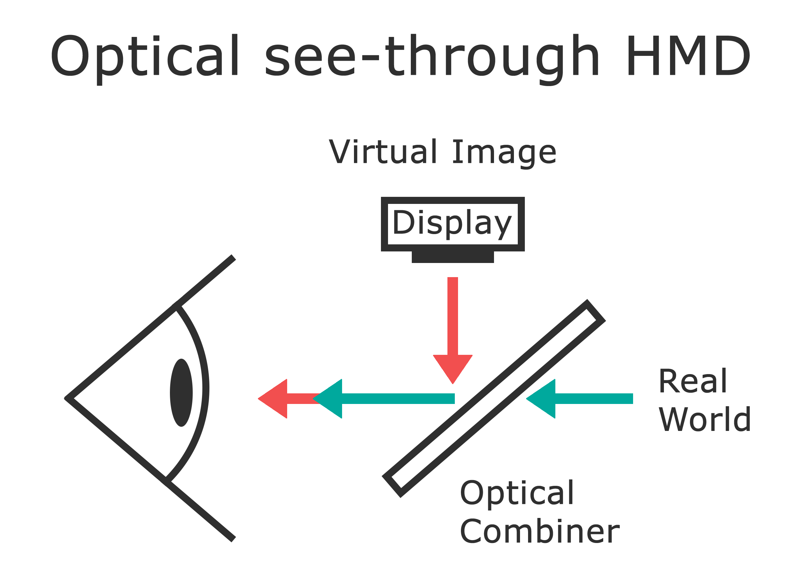
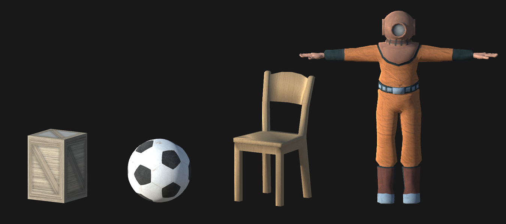
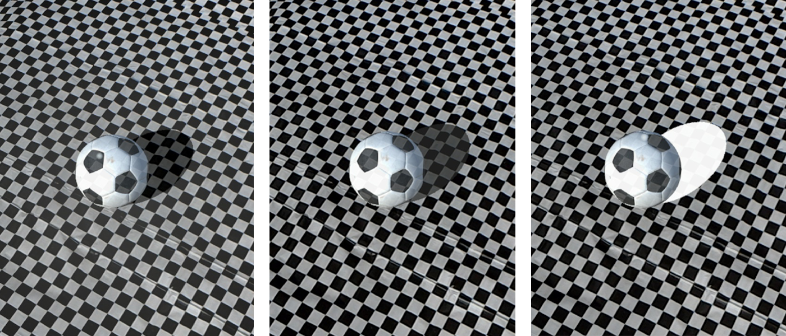
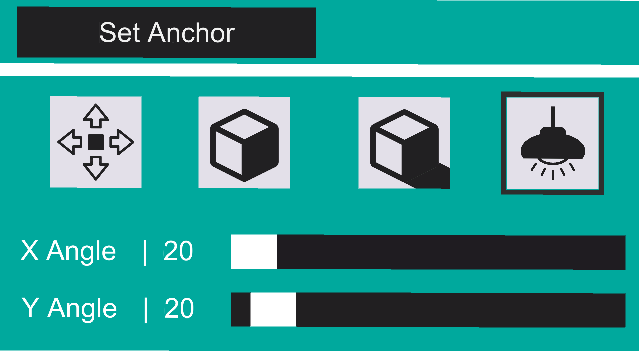
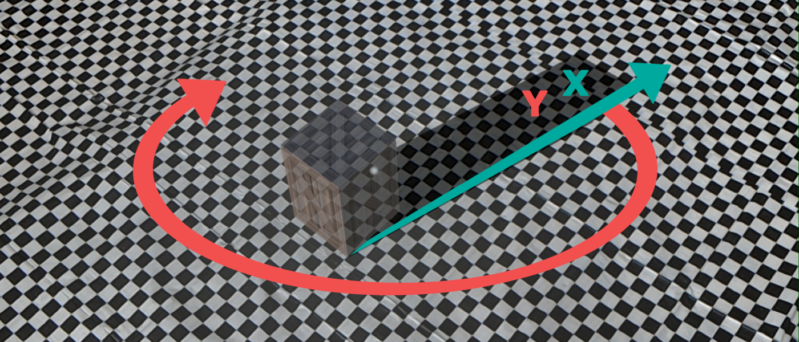
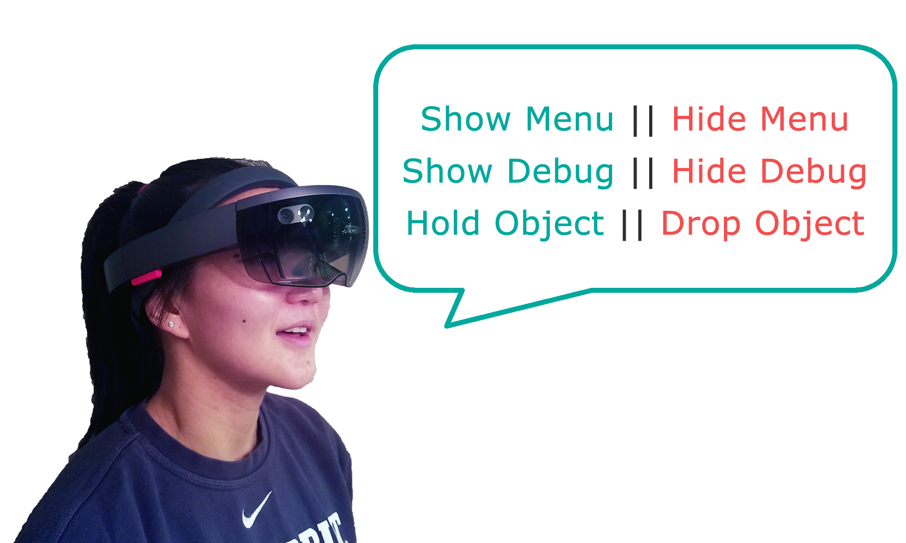
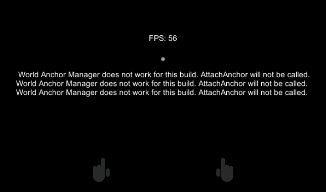

# Shadows for Optical see-through Augmented Reality 
This project demonstrates different rendering methods for creating visual ground contact between virtual objects and real surfaces through shadow in real time.

The goal of my current research is to evaluate and improve spatial perception of virtual objects in optical see-through (OST) AR displays. Specifically, in this project I want to reduce uncertainty of our spatial perception of virtual objects in real spaces by developing and evaluating different rendering methods for creating a point of contact with the ground plane. Through this project, we hope to establish developer guidelines that extend to current as well as future OST AR devices. 

### Optical See-through Displays

   

Optical see-through (OST) dislpays use additive light to render virtual graphics onto the user's view. This is generally accomplished using optical combiners, which leverage partial reflections off of glass or plastic to superimpose graphics onto a plane in front of the user's eye. The use of additive light to render color values has unique consequences for rendering. For example, dark colors appear more transluscent than light colors, and black (RGB 0,0,0) is not rendered at all. It is completely transparent. 

### Depth from Shading

However, dark colors are essential for conveying depth through shading and shadow. In 2D media, artistic techniques like chiaroscuro deliberately exaggerate light contrasts in order to create the illusion of depth. This works, because reality is rich with high constrast imagery. Traditional computer graphics relies on techniques like chiaroscuro to create a realistic appearance of depth on digital displays. For illustration, let's examine the image below. As lighting becomes more realistic, we can more confidently discern how "far back" into the painting each character is (relative to each other and to the depicted scene). 

   

In traditional computer graphics, evidence shows that shadows function as "visual glue" to attach virtual objects to virtual surfaces [1, 2]. Furthermore, people become more accurate when estimating egocentric distances (distances from the observer to a target) when objects are clearly connected to the ground via shadow [3, 4]. However, it is unclear how we can best create "visual glue" for additive light displays. These displays cannot remove light--and thereby darken--virtual or real objects. As a result, depth from shading cues are less reliable and the visual position of rendered objects in space becomes ambiguous.  

### The Problem 

Augmented objects often appear “floaty” due to system latency, tracking errors, and poor visual contact with the ground plane.  We address this last issue by asking the following questions: <b>(1)</b> Given the constraints of additive rendering, how can we better render virtual objects so that they look like they are in contact with real world surfaces? <b>(2)</b> Do rendering techniques that improve a sense of ground contact also benefit distance perception in AR? <b>(3)</b> And do these techniques benefit distance perception equally across personal <i>(0-2 m)</i>, action <i>(2-30 m)</i>, and vista <i>(>30 m)</i> space? 

## The Program
The current program was developed in 2019 with Unity 2017.4.4f1, C#, and Cg/HLSL for the Microsoft HoloLens 1. For optimal stability, I recommend scanning your room in the HoloLens and saving it to the project under the Spatial Mapping prefab. 

### Anchor Cube
Click the orange and white cube--the spatial anchor marker--and drag it into the desired position. Once in position, select the "Anchor Cube" button. The button text will change to "Look at Shadows!". The user may then view the objects or manipulate them within the game menu. 

Objects will initially spawn at the origin of the placed spatial anchor. However, if the user adjusts "distance" in the Translation menu, then the target objects will appear at that distance from origin in the direction of the orange arrow on the marker.   

   

### Position 

**Distance**: Set the target object's distance away from the spatial anchor at origin. The buttons move distance by whole units (1m) and the slider allows the user to move the object within a meter [0.00, 1.00].

**Height**: Set the object to either be on ground [0] or above ground (0, 0.1m]. 

   
  &nbsp&nbsp
     

### Objects & Textures
**Shape**: Set the object shape to be either: a cube [0], a sphere [1], a chair [2], a human diver [3], a tennis ball [4], a coffee mug [5], and a tissue box [6]. 

**Texture**: Assign the material of the object to be either white [0] or textured [1]. 

   
    &nbsp&nbsp
   

### Shadows
These sliders can be used to create "dark" shadows, photometrically incorrect shadows, negative shadows, or even the total absence of shadow. Note that Windows mixed reality capture is not an accurate representation of the HoloLen's output. 

**Shadow**: Assign the color intensity of the shadow [0,255]. 0 is black/transparent. 255 is white. 

**Ground**: Assign the color intensity of the radial gradient beneath the object [0,255]. Higher values can be used to create color contrast against the shadow, perceptually giving it a dark appearance (a negative shadow). 

   
  &nbsp&nbsp
   

### Light Angle
**X Angle**: Assign the angle of the directional light along the x axis. Depending on the object being displayed, the range of available values will change. 

**Y Angle**: Assign the angle of the directional light along the y axis [0, 360].

   
  &nbsp&nbsp  
   

### Audio Input
Audio inputs have been included. The user may show or hide the main menu by stating "Show Menu" and "Hide Menu", respectively. It is important to monitor frame rate and the status of the spatial anchors to ensure hologram stability, so debug messages showing both are included. To view these messages state "Show Debug". To hide them state "Hide Debug".  

   
  &nbsp&nbsp  
   

## Suggestions
Warning: The user needs to sanity check that the anchor is on the real world ground. 
If you preload a static map, then you may need to clean the obj file that contains the room mapping to ensure ground plane is uniform, especially if your spatial mapping is messy.  

## Citation
Copyright (c) 2019 Haley Adams. You may use and modify my code under the [Mozilla Public License 2.0](https://github.com/adhocdown/ar-shadows-simple/blob/master/LICENSE). However, please cite the associated publication. 

> Haley Adams, Jeanine Stefanucci, Sarah H Creem-Regehr, Grant Pointon, William B Thompson,  and  Bobby  Bodenheimer. Shedding Light on Cast Shadows: An Investigation of Perceived Ground Contact in AR and VR. IEEE TVCG, 2021. DOI: 10.1109/TVCG.2021.3097978

### Stay Connected

- [Website](https://adhocdown.github.io/index.html)
- [LinkedIn](https://www.linkedin.com/in/haley-alexander-adams/)
- [ResearchGate](https://www.researchgate.net/profile/Haley_Adams7)

## References

[1] [William Thomspon, Peter Shirley, Brian Smits, Daniel Kersten, Cindee Madison. Visual Glue. *Utah Technical Report*. 1998.](http://vision.psych.umn.edu/users/kersten/kersten-lab/papers/glue.pdf) 

[2] [Cindee Madison, William Thompson, Daniel Kersten, Peter Shirley, Brian Smits. Use of Interreflection and shadow for surface contact. *Psychophysics*. 2001.](https://link.springer.com/content/pdf/10.3758/BF03194461.pdf) 

[3] [David Knill, Pascal Mamassian, Daniel Kersten. Geometry of shadows. *Optim Soc Am*. 1997.](http://invibe.net/biblio_database_dyva/woda/data/att/8d31.file.pdf) 

[4] [Rui Ni, Myron Braunstein, George Anderson. Perception of scene layout from optical contact, shadow, and motion. *Perception*. 2004.](https://www.wichita.edu/academics/fairmount_college_of_liberal_arts_and_sciences/psychology/documents/Ni_2004_Perception_Shadow.pdf)

